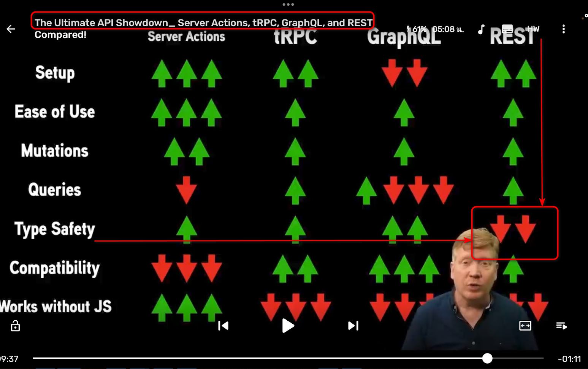

# imba-elysia-eden

test end to end type safety between frontend (https://imba.io) and backend (https://elysiajs.com) through eden lib. becuase REST is weak on type safety.
- repo url https://github.com/me7/imba-elysia-eden
- result in ...

## how do i

- [x] server using elysiajs (get/random get/rand-to get/rand-between) (ref)(https://elysiajs.com/validation/schema-type.html#example-1)
- [x] import type and use in imba. TODO:[still fail using params](https://elysiajs.com/eden/treaty/overview.html#dynamic-path)

## what i've learn
- end-to-end (api.funcName.get(params)) is better than manual(window.fetch(...)). esp for big project.
- by product is swagger page (http://srv:port/swagger)
- but... the road may a bit bumpy for imba. e.g. dynamic path is not work.
- concurrently js save you terminal qty but worth 50 dependencies added?